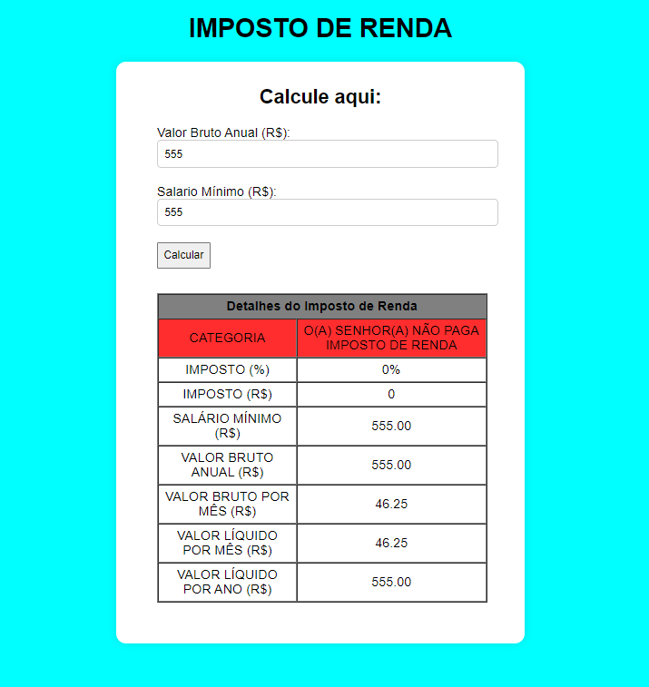
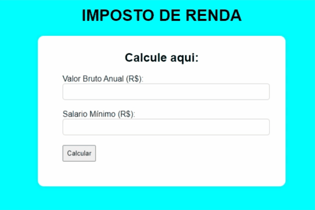

# Projeto Calculadora de Imposto de Renda

Este é um projeto que utiliza HTML, CSS e JavaScript puro em sua composição. 
Ele é um projeto prático que aborda alguns conceitos importântes dessas linguagens
que são a base para o desenvolvimento Front-end.

## Índice

- [Descrição](#descrição)
- [Instalação](#instalação)
- [Uso](#uso)
- [Contribuição](#contribuição)
- [Licença](#licença)
- [Contato](#contato)

## Descrição

Este projeto é uma aplicação web simples que utiliza HTML para estruturação, CSS para estilização e JavaScript para a lógica. O projeto inclui elementos como **formulários, botões, tabelas, e manipulação de eventos básicos no javaScript**.

## Instalação

Este projeto não requer instalação de dependências. Para visualizá-lo, você precisa apenas de um navegador web.

## Uso

Para utiliza-lo basta inserir o quanto fatura por ano: valor bruto anual (R$)
E o valor do salário mínimo no momento: valor do salário mínimo (R$)

EX:

